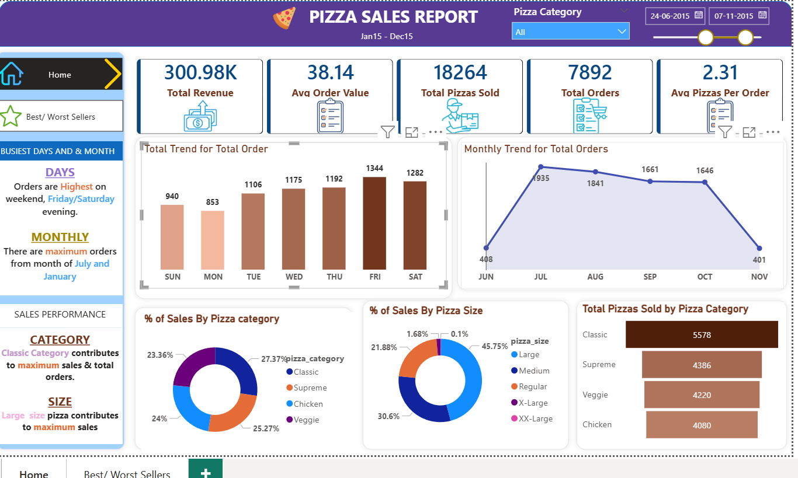

# Pizza Sales Dashboard (Power BI)

## Project Overview

This project presents a comprehensive analysis of pizza sales data using **Power BI**.
The dashboard provides insights into revenue, orders, sales trends, and product performance to support data-driven decision-making.

---

## Objective

* Analyze overall business performance
* Identify best & worst selling pizzas
* Understand customer ordering patterns
* Track sales trends across days and months

---

## Tools & Technologies

* Microsoft Power BI
* Microsoft Excel (Dataset)
* Data Cleaning & Data Modeling
* DAX (Data Analysis Expressions)

---

## Key KPIs

* Total Revenue: 817.86K
* Total Orders: 21,350
* Total Pizzas Sold: 49,574
* Average Order Value: 38.31
* Avg Pizzas per Order: 2.32

---

## Dashboard Features

### Sales Overview

* Total revenue, orders, and quantity sold
* Average order value and pizzas per order

### Trend Analysis

* Daily trend of total orders
* Monthly sales performance

### Category Insights

* Sales distribution by pizza category
* Sales distribution by pizza size

### Best Sellers Analysis

* Top 5 pizzas by:

  * Revenue
  * Quantity
  * Total Orders

### Worst Sellers Analysis

* Bottom 5 pizzas by:

  * Revenue
  * Quantity
  * Total Orders

---

## Key Insights

* **Classic category** contributes maximum revenue and orders
* **Large size pizzas** generate the highest sales share
* Orders are highest on **weekends (Friday/Saturday evenings)**
* Sales peak during **July and January**
* Certain pizzas consistently underperform and can be optimized or removed

---

## Dashboard Preview

### Home Dashboard



### Best & Worst Sellers Dashboard


---

## Project Structure

```
Pizza-Sales-Dashboard/
│
├── Pizza_Sales_Dashboard.pbix
├── dataset.xlsx
├── screenshots/
│   ├── home_dashboard.png
│   └── best_worst_dashboard.png
└── README.md
```

---

## How to Use

1. Download the `.pbix` file
2. Open in Power BI Desktop
3. Interact with filters (Pizza Category, Date Range)
4. Explore insights across dashboards

---

## Contact

If you have any questions or feedback, feel free to connect with me.

---

⭐ If you like this project, don't forget to give it a star!
